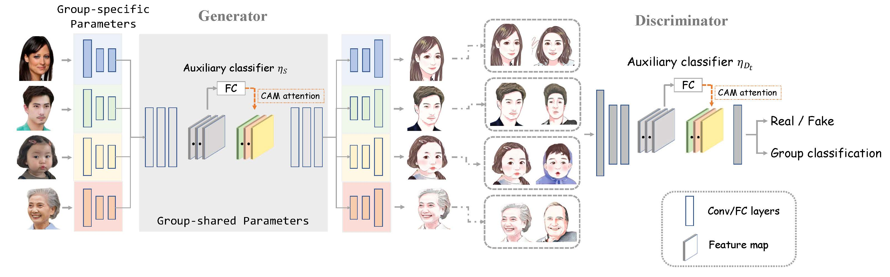

## FEW-SHOT KNOWLEDGE TRANSFER FOR FINE-GRAINED CARTOON FACE GENERATION


### [Paper](https://confcats-event-sessions.s3.amazonaws.com/icme21/papers/439.pdf)

This repository provides the **official Pytorch implementation** of our paper: FEW-SHOT KNOWLEDGE TRANSFER FOR FINE-GRAINED CARTOON FACE GENERATION (**ICME 21 oral** ).


## Requirements

* python == 3.6
* tensorflow == 2.2.0
* tensorflow_gpu==1.14.0
* torch==1.4.0
* torchvision==0.5.0
* face_alignment==1.0.0


## Pre-trained model

> We released the pre-trained single model and multi-group model so that people could test more widely. Please download the pre-trained models from  [[Google Driver]](https://drive.google.com/drive/folders/1u1Lj2Wn0OlnoK0ckm_pEOgjnfDgUn6xK?usp=sharing) 


## Dataset

> Please download the dataset from [[Google Driver]](https://drive.google.com/drive/folders/1-CI83U9aDGDlwTZW3hpIoTL7TObkzesb?usp=sharing) and extract it to ```dataset```  folder.


## Usage

### Train

We train our model on a server with a NVIDIA Tesla V100 of 32G memory.

```shell
python train.py 
```

* If the memory of gpu is **not sufficient**, set `--light` to **True**
  * But it may **not** perform well
  * paper version is `--light` to **False**

 ### Test

```shell
python test.py --dataset {folder_for_dataset} --model_path {path_to_model_ckpt} --remark {exp_name} --label {0, 1, 2, 3 for specific groups}
```


## Architecture



## Results


## Reference

Our codes refer to Project [Photo2cartoon](https://github.com/minivision-ai/photo2cartoon)

